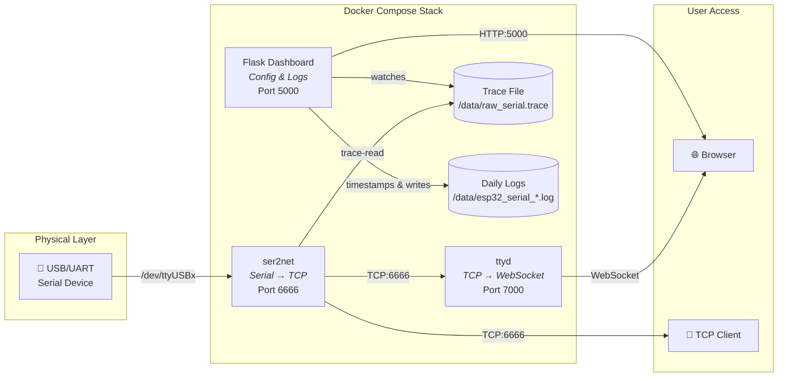

<p align="center">
  <strong>⚡ Term2Web</strong><br>
  <em>Serial-to-Web Bridge — Access your serial devices from the browser</em>
</p>

<p align="center">
  <a href="https://github.com/lorenzo-deluca"></a>
  
  
  
</p>

---

**Term2Web** is an open source tool that exposes a local serial port (USB/UART) over the network, providing both a **raw TCP socket** and an **interactive web terminal** directly in your browser. It includes a modern **web dashboard** to configure the serial port, monitor running services, and browse historical logs — all fully containerized with Docker Compose.

> This is an open source project by [Lorenzo De Luca](https://github.com/lorenzo-deluca). Contributions, issues, and feedback are welcome!

## ✨ Features

- 🔌 **Serial-to-TCP bridge** via [ser2net](https://github.com/cminyard/ser2net) — connect any tool to your serial port over TCP
- 🖥️ **Web-based interactive terminal** via [ttyd](https://github.com/tsl0922/ttyd) — full serial console in the browser with read/write support
- ⚙️ **Configuration dashboard** — select serial port, apply settings, and restart services from the UI
- 📋 **Live serial monitor** — real-time log preview with ANSI color support and reception timestamps
- 📁 **Daily log archives** — automatic daily log rotation with date-based files and reverse-chronological display
- 🐳 **Docker Compose** — multi-container architecture, single `docker-compose up` to get started
- 🏗️ **Multi-architecture** — supports `x86_64` and `aarch64` (ARM64)

## 🏛️ Architecture



## 🔧 How It Works

Term2Web uses **Docker Compose** to orchestrate three containers:

| Container | Service | Role | Port |
|---|---|---|---|
| `ser2web_ser2net` | **ser2net** | Bridges the physical serial port to a TCP socket. Writes raw trace data to disk. | `6666` |
| `ser2web_ttyd` | **ttyd** | Connects to the ser2net TCP socket and exposes it as an interactive web terminal via WebSocket. | `7000` |
| `ser2web_web` | **Flask app** | Web dashboard. Watches the trace file, adds timestamps, writes daily log files, and provides the configuration UI. | `5001` |

### Data Flow

1. The **serial device** (e.g. an ESP32 on `/dev/ttyUSB0`) sends data through the USB/UART interface
2. **ser2net** reads the serial port and exposes it as a TCP socket on port `6666`, while writing raw serial data to a trace file (`/data/raw_serial.trace`)
3. **ttyd** connects to `ser2net:6666` and streams the data to the browser as an interactive web terminal on port `7000` (with write support via the `-W` flag)
4. The **Flask dashboard** watches the trace file, timestamps each line (`[YYYY-MM-DD HH:MM:SS]`), and writes to daily log files (`/data/esp32_serial_YYYY-MM-DD.log`). It provides a UI to change the serial port, restart services, and browse live/archived logs

### Logging

Serial output is automatically logged with reception timestamps to date-based files:

```
/data/esp32_serial_2026-02-26.log
/data/esp32_serial_2026-02-25.log
...
```

Each line is prefixed with a timestamp:
```
[2026-02-26 09:30:15] I (12345) wifi: connected to AP
[2026-02-26 09:30:16] I (12346) app: Starting main loop
```

Logs are displayed in **reverse chronological order** (newest first) in both the live monitor and the archive viewer.

## 🚀 Installation

### Docker Compose (Recommended)

This is the simplest and recommended way to run Term2Web.

**Prerequisites:** [Docker](https://docs.docker.com/get-docker/) and [Docker Compose](https://docs.docker.com/compose/install/)

```bash
# Clone the repository
git clone https://github.com/lorenzo-deluca/Term2Web.git
cd Term2Web

# Start the application
docker-compose up -d
```

The `ser2net` container runs in **privileged mode** to access the host's serial devices under `/dev`.

| URL | Service |
|---|---|
| `http://localhost:5001` | Dashboard |
| `http://localhost:7000` | Web Terminal |
| `localhost:6666` | Raw TCP serial socket |

To stop:

```bash
docker-compose down
```

## ⚙️ Configuration

### Serial Port

Use the web dashboard at `http://localhost:5001` to:

1. Select the serial port from the dropdown (auto-detected)
2. Click **Apply & Restart** to reconfigure `ser2net` and `ttyd`

### ser2net Settings

The generated `ser2net.yaml` configuration uses the following defaults:

| Parameter | Value |
|---|---|
| Baud rate | `115200` |
| Data bits | `8` |
| Parity | `None` |
| Stop bits | `1` |
| TCP port | `6666` |
| Kick old user | `true` |

### Exposed Ports

| Port | Protocol | Service |
|---|---|---|
| `5001` | HTTP | Flask Dashboard |
| `7000` | HTTP/WS | ttyd Web Terminal |
| `6666` | TCP | ser2net raw serial socket |

## 📂 Project Structure

```
Term2Web/
├── docker-compose.yml        # Multi-container orchestration
├── ser2net/
│   └── Dockerfile            # ser2net container
├── ttyd/
│   └── Dockerfile            # ttyd container (with socat)
├── web/
│   ├── Dockerfile            # Flask dashboard container
│   ├── app.py                # Flask application + trace watcher
│   ├── templates/
│   │   └── index.html        # Dashboard UI (single-page app)
│   └── requirements.txt      # Python dependencies
├── data/                     # Shared volume for config & logs
│   ├── ser2net.yaml          # ser2net configuration (auto-generated)
│   ├── raw_serial.trace      # Raw ser2net trace file
│   └── esp32_serial_*.log    # Daily timestamped log files
└── README.md
```

## 📄 License

This project is open source. See the repository for license details.

---

<p align="center">
  Made with ❤️ by <a href="https://github.com/lorenzo-deluca">Lorenzo De Luca</a>
</p>
