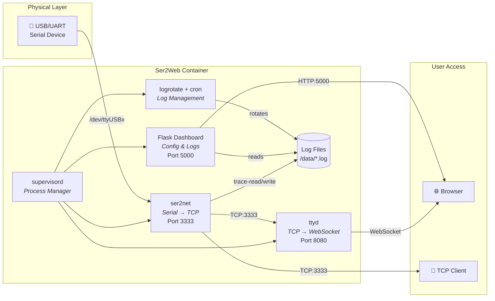

<p align="center">
  <strong>⚡ Ser2Web</strong><br>
  <em>Serial-to-Web Bridge — Access your serial devices from the browser</em>
</p>

<p align="center">
  <a href="https://github.com/lorenzo-deluca"></a>
  
  
  
</p>

---

**Ser2Web** is an open source tool that exposes a local serial port (USB/UART) over the network, providing both a **raw TCP socket** and an **interactive web terminal** directly in your browser. It includes a modern **web dashboard** to configure the serial port, monitor running services, and browse historical logs — all from a single, containerized application.

> This is an open source project by [Lorenzo De Luca](https://github.com/lorenzo-deluca). Contributions, issues, and feedback are welcome!

## ✨ Features

- 🔌 **Serial-to-TCP bridge** via [ser2net](https://github.com/cminyard/ser2net) — connect any tool to your serial port over TCP
- 🖥️ **Web-based interactive terminal** via [ttyd](https://github.com/tsl0922/ttyd) — full serial console in the browser
- ⚙️ **Configuration dashboard** — select serial port, apply settings, and restart services from the UI
- 📋 **Live log preview** — tail the last 50 lines of serial output with ANSI color support
- 📁 **Log archive viewer** — browse and read historical log files with automatic rotation
- 🐳 **Docker-ready** — single `docker-compose up` to get started
- 🏗️ **Multi-architecture** — supports `x86_64` and `aarch64` (ARM64)

## 🏛️ Architecture



## 🔧 How It Works

Ser2Web orchestrates four services via **supervisord**:

| Service | Role | Port |
|---|---|---|
| **ser2net** | Bridges the physical serial port to a TCP socket. All serial I/O is logged to disk. | `3333` |
| **ttyd** | Connects to the ser2net TCP socket and exposes it as a web terminal via WebSocket. | `8080` |
| **Flask app** | Web dashboard to select the serial port, apply configuration, monitor service status, and view logs. | `5000` |
| **cron + logrotate** | Automatically rotates log files daily, keeping the last 30 days of history. | — |

### Data Flow

1. The **serial device** (e.g. an ESP32 on `/dev/ttyUSB0`) sends data through the USB/UART interface
2. **ser2net** reads the serial port and exposes it as a TCP socket on port `3333`, while also writing all traffic to log files
3. **ttyd** connects to `localhost:3333` and streams the data to the browser as an interactive web terminal on port `8080`
4. The **Flask dashboard** on port `5000` provides a UI to change the serial port, restart services, and browse live/archived logs

## 🚀 Installation

### Docker Compose (Recommended)

This is the simplest and recommended way to run Ser2Web.

**Prerequisites:** [Docker](https://docs.docker.com/get-docker/) and [Docker Compose](https://docs.docker.com/compose/install/)

```bash
# Clone the repository
git clone https://github.com/lorenzo-deluca/Term2Web.git
cd Term2Web/src

# Start the application
docker-compose up -d
```

The container runs in **privileged mode** to access the host's serial devices under `/dev`.

| URL | Service |
|---|---|
| `http://localhost:5000` | Dashboard |
| `http://localhost:8080` | Web Terminal |
| `localhost:3333` | Raw TCP serial socket |

To stop:

```bash
docker-compose down
```

---

### Native Installation

For running directly on the host machine without Docker. All platforms require the same core dependencies.

#### Prerequisites

| Dependency | Purpose |
|---|---|
| **Python 3.11+** | Flask dashboard |
| **ser2net** | Serial-to-TCP bridge |
| **ttyd** | Web terminal |
| **supervisor** | Process manager |
| **logrotate** + **cron** | Log rotation |

---

#### 🐧 Linux (Debian/Ubuntu)

```bash
# Install system dependencies
sudo apt-get update
sudo apt-get install -y ser2net supervisor telnet cron logrotate wget

# Install ttyd
ARCH=$(uname -m)
sudo wget -q "https://github.com/tsl0922/ttyd/releases/download/1.7.7/ttyd.${ARCH}" \
  -O /usr/local/bin/ttyd
sudo chmod +x /usr/local/bin/ttyd

# Clone and install Python dependencies
git clone https://github.com/lorenzo-deluca/Term2Web.git
cd Term2Web/src
pip install -r requirements.txt

# Setup data and log directories
sudo mkdir -p /data
sudo touch /data/esp32_serial.log
sudo chmod 666 /data/esp32_serial.log

# Setup log rotation
sudo cp logrotate_esp32.conf /etc/logrotate.d/esp32_serial
sudo chmod 0644 /etc/logrotate.d/esp32_serial

# Start with supervisord
supervisord -c supervisord.conf
```

---

#### 🍎 macOS

```bash
# Install system dependencies via Homebrew
brew install ser2net supervisor

# Install ttyd
brew install ttyd

# Clone and install Python dependencies
git clone https://github.com/lorenzo-deluca/Term2Web.git
cd Term2Web/src
pip3 install -r requirements.txt

# Setup data and log directories
sudo mkdir -p /data
sudo touch /data/esp32_serial.log
sudo chmod 666 /data/esp32_serial.log

# Start with supervisord
supervisord -c supervisord.conf
```

> [!NOTE]
> On macOS, serial devices typically appear as `/dev/tty.usbserial-*` or `/dev/cu.usbmodem*` instead of `/dev/ttyUSB*`.

---

#### 🪟 Windows

Running natively on Windows requires **WSL2** (Windows Subsystem for Linux), since `ser2net` and `ttyd` are Linux-native tools.

```powershell
# 1. Install WSL2 (from PowerShell as Administrator)
wsl --install -d Ubuntu

# 2. Inside WSL2, follow the Linux installation steps above
```

> [!IMPORTANT]
> To pass USB devices from Windows into WSL2, you need [usbipd-win](https://github.com/dorssel/usbipd-win):
>
> ```powershell
> # From PowerShell (Administrator)
> winget install usbipd
>
> # List USB devices
> usbipd list
>
> # Bind and attach your serial device to WSL2
> usbipd bind --busid <BUS-ID>
> usbipd attach --wsl --busid <BUS-ID>
> ```
>
> After attaching, the device will appear as `/dev/ttyUSB0` inside WSL2.

Alternatively, use **Docker Desktop for Windows** with the Docker Compose method described above.

## ⚙️ Configuration

### Serial Port

Use the web dashboard at `http://localhost:5000` to:

1. Select the serial port from the dropdown (auto-detected)
2. Click **Apply & Restart** to reconfigure `ser2net` and `ttyd`

### ser2net Settings

The generated `ser2net.yaml` configuration uses the following defaults:

| Parameter | Value |
|---|---|
| Baud rate | `115200` |
| Data bits | `8` |
| Parity | `None` |
| Stop bits | `1` |
| TCP port | `3333` |
| Kick old user | `true` |

### Exposed Ports

| Port | Protocol | Service |
|---|---|---|
| `5000` | HTTP | Flask Dashboard |
| `8080` | HTTP/WS | ttyd Web Terminal |
| `3333` | TCP | ser2net raw serial |

## 📂 Project Structure

```
Term2Web/
├── src/
│   ├── app.py                  # Flask web application
│   ├── templates/
│   │   └── index.html          # Dashboard UI (single-page app)
│   ├── Dockerfile              # Multi-arch Docker image
│   ├── docker-compose.yml      # One-command deployment
│   ├── supervisord.conf        # Process manager configuration
│   ├── logrotate_esp32.conf    # Log rotation policy
│   └── requirements.txt        # Python dependencies
└── README.md
```

## 📄 License

This project is open source. See the repository for license details.

---

<p align="center">
  Made with ❤️ by <a href="https://github.com/lorenzo-deluca">Lorenzo De Luca</a>
</p>
