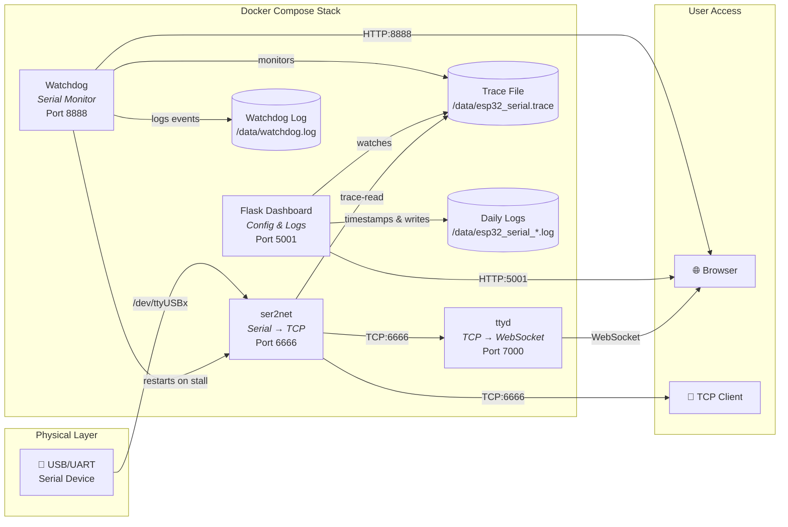

<h1 align="center">
  ⚡ term-2-web
</h1>

<p align="center">
  <em>Mission-critical Serial-to-Web Bridge — Access your serial devices from the browser</em>
</p>

<p align="center">
  <a href="https://github.com/lorenzo-deluca/term-2-web/stargazers"></a>
  <a href="https://github.com/lorenzo-deluca/term-2-web/network/members"></a>
  <a href="https://github.com/lorenzo-deluca/term-2-web/issues"></a>
  <a href="https://github.com/lorenzo-deluca/term-2-web/blob/main/LICENSE"></a>
  <br>
  
  
</p>

---

**term-2-web** is an open-source tool that exposes a local serial port (USB/UART) over the network, providing both a **raw TCP socket** and an **interactive web terminal** directly in your browser. It includes a modern **web dashboard** to configure the serial port, monitor running services, and browse historical logs — all fully containerized with Docker Compose.

Designed specifically for **headless, mission-critical, remote deployments** (e.g., a Raspberry Pi in the field or a Hardware-in-the-Loop simulator), it features a built-in **serial watchdog** that automatically detects data flow stalls and recovers the serial pipeline without human intervention.

---

## 📑 Table of Contents

- [✨ Features](#-features)
- [💡 Use Cases](#-use-cases)
- [🚀 Installation](#-installation)
- [🏛️ Architecture & Data Flow](#️-architecture--data-flow)
- [🛡️ Production Hardening (Raspberry Pi)](#️-production-hardening-raspberry-pi)
- [⚙️ Configuration](#️-configuration)
- [🛠️ Troubleshooting](#️-troubleshooting)
- [🤝 Contributing](#-contributing)
- [📄 License](#-license)

---

## ✨ Features

- 🔌 **Serial-to-TCP bridge** via [ser2net](https://github.com/cminyard/ser2net) — connect any external tool to your serial port over TCP.
- 🖥️ **Web-based interactive terminal** via [ttyd](https://github.com/tsl0922/ttyd) — full serial console in the browser with read/write support.
- ⚙️ **Configuration dashboard** — select the serial port, apply settings, and restart services from a user-friendly UI.
- 📋 **Live serial monitor** — real-time log preview with ANSI color support and reception timestamps.
- 📁 **Daily log archives** — automatic daily log rotation with date-based files and reverse-chronological display.
- 🐳 **Docker Compose** — multi-container architecture, single `docker compose up` to get started.
- 🏗️ **Multi-architecture** — natively supports `x86_64` and `aarch64` (ARM64).
- 🛡️ **Serial watchdog** — automatically detects serial data stalls and restarts the pipeline to recover.
- ❤️‍🩹 **Health monitoring** — Docker healthchecks + HTTP endpoints for external monitoring integrations.

## 💡 Use Cases

Why use term-2-web instead of traditional tools like `screen` or `picocom`?

1. **Hardware-in-the-Loop (HIL) Testing**: Connect your remote test rigs to your CI/CD pipeline via the raw TCP socket while keeping UI access for manual debugging.
2. **Remote IoT Gateways**: Deploy on a Raspberry Pi connected to field sensors. No need to SSH into the device to check serial logs; just open the web dashboard.
3. **Unattended Logging**: Automatically capture daily, timestamped serial logs without leaving terminal sessions open.
4. **Self-Healing Infrastructure**: The built-in watchdog ensures that kernel buffer bloat or USB driver hiccups don't cause silent data loss.

---

## 🚀 Installation

### Prerequisites
- [Docker](https://docs.docker.com/get-docker/)
- [Docker Compose (v2)](https://docs.docker.com/compose/install/)

### Quick Start

```bash
# 1. Clone the repository
git clone https://github.com/lorenzo-deluca/term-2-web.git
cd term-2-web

# 2. Start the application
docker compose up -d

# 3. Check status
docker compose ps
```

The `ser2net` container runs in **privileged mode** to access the host's serial devices under `/dev`.

| URL | Service | Description |
|---|---|---|
| `http://localhost:5001` | **Dashboard** | Web UI for config and logs |
| `http://localhost:7000` | **Web Terminal** | Interactive browser console |
| `localhost:6666` | **Raw TCP socket** | Connect via `nc`, `telnet`, or custom scripts |
| `http://localhost:8888/health` | **Watchdog Health** | JSON diagnostic endpoint |

To stop the Stack:
```bash
docker compose down
```
> **Note:** A simple `docker stop <container>` will trigger an automatic restart due to the `restart: always` policy. Always use `docker compose down`.

---

## 🏛️ Architecture & Data Flow



### Data Flow Lifecycle
1. **Intake**: Hardware device sends data. `ser2net` reads it (with `low_latency` flag enabled to bypass kernel buffering) and exposes it on TCP `6666`.
2. **Raw Trace**: `ser2net` continuously writes a raw dump to `esp32_serial.trace`.
3. **Processing**: The **Flask** app reads the trace, appends `[YYYY-MM-DD HH:MM:SS]` timestamps, and chunks data into daily `.log` files.
4. **Monitoring**: The **Watchdog** tracks the trace file size. If no bytes are written for 60 seconds, it issues a Docker API restart command to `ser2net` to clear stuck buffers.
5. **UI**: **ttyd** connects to the TCP socket to provide the live web terminal.

---

## 🛡️ Production Hardening (Raspberry Pi)

When deploying on a remote Raspberry Pi, device paths (`/dev/ttyUSBx`) can change upon reboot. Follow these steps on the host OS for maximum reliability.

### 1. Stable Device Naming (udev)
Create a persistent symlink that survives reboots.

Find your device's VID/PID:
```bash
udevadm info --name=/dev/ttyUSB0 --attribute-walk | grep -E 'idVendor|idProduct'
```

Create a rule `/etc/udev/rules.d/99-serial-devices.rules`:
```text
SUBSYSTEM=="tty", ATTRS{idVendor}=="10c4", ATTRS{idProduct}=="ea60", SYMLINK+="esp_serial", MODE="0666"
```
Reload rules (`sudo udevadm control --reload-rules && sudo udevadm trigger`). You can now permanently select `/dev/esp_serial` in the term-2-web Dashboard.

### 2. Auto-Start on Boot (systemd)
Ensure the stack boots with the Pi:

```bash
sudo tee /etc/systemd/system/term-2-web.service > /dev/null <<EOF
[Unit]
Description=term-2-web Serial Bridge
Requires=docker.service
After=docker.service network-online.target

[Service]
Type=simple
WorkingDirectory=/path/to/term-2-web
ExecStart=/usr/bin/docker compose up
ExecStop=/usr/bin/docker compose down
Restart=always
RestartSec=10

[Install]
WantedBy=multi-user.target
EOF

sudo systemctl daemon-reload && sudo systemctl enable term-2-web && sudo systemctl start term-2-web
```

### 3. SD Card Protection
Docker logs can destroy SD cards. Add log limits to `/etc/docker/daemon.json`:
```json
{
  "log-driver": "json-file",
  "log-opts": { "max-size": "10m", "max-file": "3" }
}
```

---

## ⚙️ Configuration

### Global Configuration (`docker-compose.yml`)

The watchdog behavior can be tuned via environment variables:

| Variable | Default | Description |
|---|---|---|
| `SILENCE_THRESHOLD_SEC` | `60` | Seconds of no data before triggering a pipeline restart. **Increase this if your device legitimately stays silent for >1 minute.** |
| `CHECK_INTERVAL_SEC` | `10` | Trace file polling interval. |

### Serial Settings (`ser2net.yaml`)
Automatically generated by the Web UI. Defaults to `115200 8N1`.

---

## 🛠️ Troubleshooting

- **No data in the Web Terminal**: 
  Check if the Watchdog is restarting the service: `tail -f data/watchdog.log`. If it is restarting constantly, your device might be unplugged or `SILENCE_THRESHOLD_SEC` is too low.
- **Port not showing in Dropdown**:
  Ensure the `ser2web_web` container has `privileged: true` and `/dev:/dev` mapped in `docker-compose.yml`.
- **System runs out of memory**:
  The stack is hard-capped (Flask: 256m, ser2net: 128m, others: 64m). If OOM errors occur, check `docker stats`.

---

## 🤝 Contributing

Contributions are what make the open source community such an amazing place to learn, inspire, and create. Any contributions you make are **greatly appreciated**.

1. Fork the Project
2. Create your Feature Branch (`git checkout -b feature/AmazingFeature`)
3. Commit your Changes (`git commit -m 'Add some AmazingFeature'`)
4. Push to the Branch (`git push origin feature/AmazingFeature`)
5. Open a Pull Request

---

## 📄 License

Distributed under the **MIT License**. See `LICENSE` for more information.

<p align="center">
  Made with ❤️ by <a href="https://github.com/lorenzo-deluca">Lorenzo De Luca</a>
</p>
